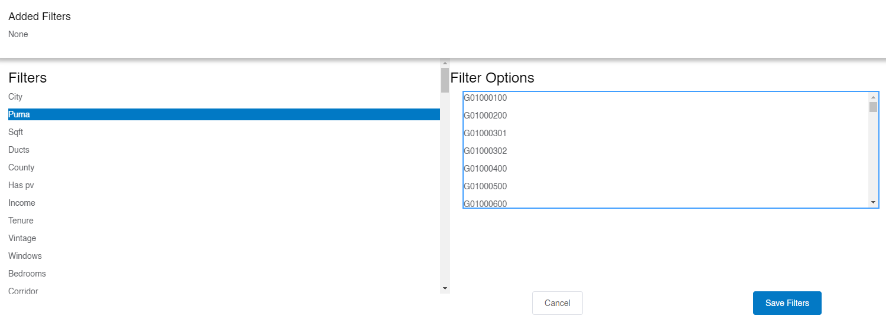

# Geographic Fields and Codes
ResStock provides many geographic fields to allow for a variety of analysis. Many of the geographic codes are self-explanatory, such as the name of the county, but there are some codes that are not as user friendly. Sometimes these codes can represent counties, census tracts, and PUMAs. **ResStock uses the National Historical GIS (NHGIS) GISJOIN standard codes for 2010 counties, 2010 PUMAs, and 2010 Census Tracts. 2020 geographic codes are not available at this time.** That means that all 2020 geographic codes must be converted to 2010 codes before using ResStock.

These are based on Federal Information Processing Standard (FIPS) codes. Example names of columns that include these geographic codes include **in.county** or **in.county_and_puma**. They can even be seen in the [Data Viewer](https://resstock.nrel.gov) when trying to filter by PUMA. It starts with a G followed by several numbers. Below is an example.

Want to learn how to convert your geography into the right ResStock format? Examples are provided below on how to find the 2010 PUMA. After converting your geography into the right format, use the [Check That You Have Enough Samples or Dwelling Units with the Data Viewer]({{ site.baseurl }}) tutorial with the Data Viewer example to make sure your region is broad enough to draw conclusions from; otherwise your sample size is too low and you could have a large margin of error in your results.

## Neighborhood Into 2010 PUMA
Background: Your community wants to analyze the neighborhoods around NLR’s campus in Golden, Colorado. The neighborhoods are located to the southeast of Applewood Golf Course and west of Maple Grove Reservoir in Golden.

**Step 1:** Open [this website](https://usa.ipums.org/usa/volii/pumas20.shtml#web-map) and scroll down to the Web Map of 2010 and 2020 PUMAs.

**Step 2:** Search "Applewood Golf Course" and choose the location in Colorado. Looking at this search area, the two neighborhoods are pretty close together. Zooming out, you can see they are enclosed in the same orange and blue areas.

**Step 3:** Click on the blue numbers, "00702," which loads a pop up window, 2020 PUMA. We know ResStock takes the 2010 PUMA, so click on the right arrow that is not in the circle. This pulls up the 2010 PUMA. Click on the right arrow in the circle.

**Step 4:** This loads a small box with the State, State FIP, PUMA, and PUMA Name listed. The State is Colorado, the State FIP is 08, the 2010 PUMA is 00818, and the PUMA Name is Jefferson County (East Central) – Lakewood (North), Wheat Ridge & Golden Cities PUMA.

**Step 5:** Turn this information into a PUMA fit for ResStock. Combine the **State FIP**, <ins>an additional 0</ins>, and then the *2010 PUMA value*. For this example, it would be **08**<ins>0</ins>*00818*. Now you have the 2010 PUMA value! And luckily, the small box also has the 2010 County name, Jefferson County.

The 2010 PUMA and the 2010 County name are great starting points for the Data Viewer and other ResStock resources.

## 2020 PUMA into 2010 PUMA
Background: Your community has given you the 2020 PUMA code for Research Road, an area right outside of NLR’s campus in Golden, Colorado. They give you 00702 as the 2020 PUMA code. We have to convert that to a 2010 PUMA code for many ResStock resources.

**Step 1:** Open [this website](https://usa.ipums.org/usa/volii/pumas20.shtml#web-map) and scroll down to the Web Map of 2010 and 2020 PUMAs.

**Step 2:** Search Research Road and choose the location in Colorado. Looking at this search area, we see the blue numbers 00702, the 2020 PUMA values your community gave you.

**Step 3:** Click on the blue numbers, 00702, which loads a small pop-up window 2020 PUMA. We know ResStock takes the 2010 PUMA, so click on the right arrow that is not in the circle. This pulls up the 2010 PUMA. Click on the right arrow in the circle.

**Step 4:** This loads a small box that has the State, State FIP, PUMA, and PUMA Name listed. The State is Colorado, the State FIP is 08, the 2010 PUMA is 00818, and the PUMA Name is Jefferson County (East Central) – Lakewood (North), Wheat Ridge & Golden Cities PUMA.

**Step 5:** Turn this information into a PUMA fit for ResStock. Combine the **State FIP**, <ins>an additional 0</ins>, and then the *2010 PUMA value*. For this example, it would be **08**<ins>0</ins>*00818*. Now you have the 2010 PUMA value! And luckily, the small box also has the 2010 County name, Jefferson County.

## 2020 Census Tract to 2010 PUMA
Background: Your community has given you the 2020 Census Tract for Research Road, an area right outside of NLR’s campus in Golden, Colorado. They have given you 08059010100. We have to convert that to a 2010 PUMA code for many ResStock resources.

### Example 1: Approximation
**Step 1:** Open [this website](https://www.census.gov/library/visualizations/2021/geo/demographicmapviewer.html). Click "Colorado" and zoom into the area for Research Road in Golden, CO.

**Step 2:** Click on the light blue area that includes Research Road; the area is called Applewood. Zoom out to get a better idea of the area.

**Step 3:** In a new tab, open [this website](https://usa.ipums.org/usa/volii/pumas20.shtml#web-map). Type in "Research Road" and zoom out so the area covered approximately matches the area highlighted in Step 2.

**Step 4:** Eyeball the census tract covered in Step 2 and overlap that with the map in Step 3 to identify the 2020 PUMA value (the blue number in the region that includes Research Road).

**Step 5:** Click on the 2020 PUMAs value in the step 3 website, 00702 in this example.

**Step 6:** Click to the right within the 2020 PUMA pop-up, and then you will see the 2010 PUMA pop-up. Click within the cell and you will see the 2010 PUMA value of 00818.

**Step 7:** Turn this information into a PUMA fit for ResStock. Combine the **State FIP**, <ins>an additional 0</ins>, and then the *2010 PUMA value*. For this example, it would be **08**<ins>0</ins>*00818*. Now you have the 2010 PUMA value!

### Example 2: Exact
**Step 1:** Open the [Explanation of the 2020 Census Tract to 2010 Census Tract Relationship File](https://www2.census.gov/geo/pdfs/maps-data/data/rel2020/tract/explanation_tab20_tract20_tract10.pdf). Then, go to the [Relationship Files](https://www.census.gov/geographies/reference-files/time-series/geo/relationship-files.2020.html#tract), and scroll down to the Census Tract Relationship Files and in the State-level 2020 Census Tract to 2010 Census Tract Relationship Files, choose Colorado.

**Step 2:** Search the text files that pops up for your 2020 Census Tract Number: 08059010100. Make sure the field that matches is the second one in the line, because that corresponds with the GEOID_TRACT_20 field, which we want.

**Step 3:** In this example, there are two lines that have a GEOID_TRACT_20 field that match our 2020 Census Tract. We need to figure out which one is the right one.

**Step 4:** Go to [2010 Census Tract Reference Maps](https://www.census.gov/geographies/reference-maps/2010/geo/2010-census-tract-maps.html), click Colorado, and go down to the county for this community. We know it is Jefferson County.

**Step 5:** Open each map and see if our location, Research Road in Golden, is on there. For our area it was on file DC10CT_C08059_001.pdf file.

**Step 6:** Scroll in on the map until you can find your location, and write down the census tract number which on this map is the bolded red text. In this case, it is 101.

**Step 7:** Go back to the file in Step 3. Remember, the 2020 Census Tract value 08059010100 came up twice in the 2020 column, so we need to figure out the 2010 column.

**Step 8:** Looking at the two matching rows, one row has the words Census Tract 1010 in the NAMELSAD_TRACT_10 column, which we know from Step 6 is the right census tract for 2010. We now know this is the right row.

**Step 9:** Look at the GEOID_TRACT_10 column for that row, and that is our 2010 Census Tract Number. In this example it is, 08059010100. Now we convert that to a 2010 PUMA value.

**Step 10:** Go to the [Census Tract to PUMA Relationship Files](https://www.census.gov/programs-surveys/geography/guidance/geo-areas/pumas.html#:~:text=Census%20Tract%20to%20PUMA%20Relationship,building%20block%20of%20PUMA%20geography), and choose the 2010 Census Tract to 2010 PUMA Relationship File and open it.

**Step 11:** Search the 2010 PUMA with commas separated. 08059010100 turns into 08,059,010100. When you search for the 08,059,010100 it matches one line, and the values after the 2010 Census Tract are 00818 which is the five-digit PUMA code.

**Step 12:** Turn this information into a PUMA fit for ResStock. Combine the **State FIP**, <ins>an additional 0</ins>, and then the *2010 PUMA value*. For this example, it would be **08**<ins>0</ins>*00818*. Now you have the 2010 PUMA value!

## 2010 Census Tract to 2010 PUMA
Background: The community gives you the 2010 census tract value for Research Road, right outside of NLR’s Golden, Colorado campus. They give you 08059010100.

**Step 1:** Go to the [Census Tract to PUMA Relationship Files](https://www.census.gov/programs-surveys/geography/guidance/geo-areas/pumas.html#:~:text=Census%20Tract%20to%20PUMA%20Relationship,building%20block%20of%20PUMA%20geography), and choose the 2010 Census Tract to 2010 PUMA Relationship File and open it.

**Step 2:** Search the 2010 PUMA with commas separated. 08059010100 turns into 08,059,010100. When you search for the 08,059,010100 it matches one line, and the values after the 2010 Census Tract are 00818 which is the 5 digit PUMA code. 

**Step 3:** Turn this information into a PUMA fit for ResStock. Combine the **State FIP**, <ins>an additional 0</ins>, and then the *2010 PUMA value*. For this example, it would be **08**<ins>0</ins>*00818*. Now you have the 2010 PUMA value!

## County to 2010 PUMA
Background: The community says they want to analyze Jefferson County, the county where NLR’s Golden, Colorado, campus is located.

**Step 1:** Make sure that county name has not undergone any changes by pulling up the [Changes to Counties](https://www.census.gov/programs-surveys/geography/technical-documentation/county-changes.2000.html#list-tab-957819518) website. Best to go from present day, 2020s, back to 2000, to make sure the county name has not changed in recent history. We see that Jefferson County is one that underwent changes back in 2001.

**Step 2:** Because Jefferson County has not undergone any changes since 2001, we can look at the 2010 maps.

**Step 3:** Go to the [2010 Census Public Use Microdata Area (PUMA) Reference Maps](https://www.census.gov/geographies/reference-maps/2010/geo/2010-pumas.html), and choose Colorado.

**Step 4:** Search for the word Jefferson to easily highlight the state and the PUMA values that Jefferson County covers.

**Step 5:** Record the values, they are written as two state numbers or FIP code, an additional zero, and then five PUMA numbers. For example, for the value 08000801, the PUMA value would be 00801. Looking at the list, the PUMAs that Jefferson County includes are: 00801, 00804, 00805, 00817, 00818, 00819, 00820, and 00821. These are the 2010 PUMAs for Jefferson County.

**Step 6:** Turn this information into a PUMA fit for ResStock. Combine the **State FIP**, <ins>an additional 0</ins>, and then the *2010 PUMA value*. The codes turn into 08000801, 08000804, 08000805, 08000817, 08000818, 08000819, 08000820, and 08000821.

##  Additional Note
Additionally, some published datasets have a spatial lookup table: [spatial_tract_lookup_table.csv](https://data.openei.org/s3_viewer?bucket=oedi-data-lake&prefix=nrel-pds-building-stock%2Fend-use-load-profiles-for-us-building-stock%2F2021%2Fresstock_amy2018_release_1%2Fgeographic_information%2F) is one example. County and PUMA codes can be looked up using the **nhgis_county_gisjoin** and **nhgis_puma_gisjoin** columns, respectively. To find the pre-aggregated timeseries file for a county or PUMA, use this lookup to find the code for the county or PUMA of interest.