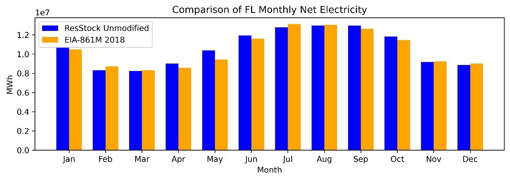
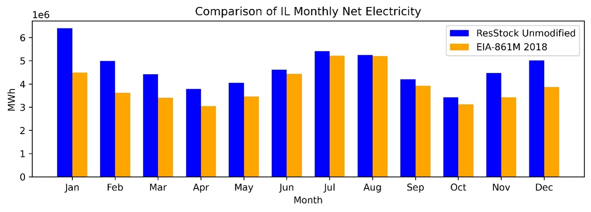
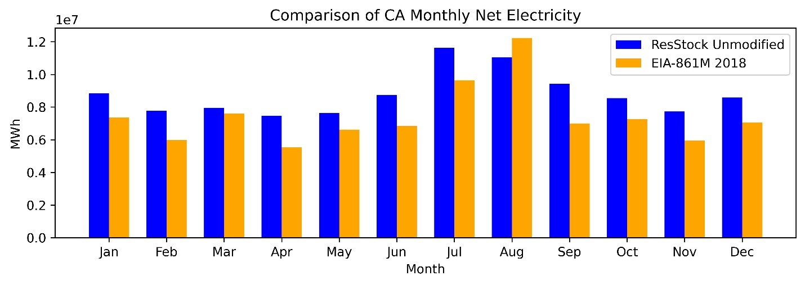
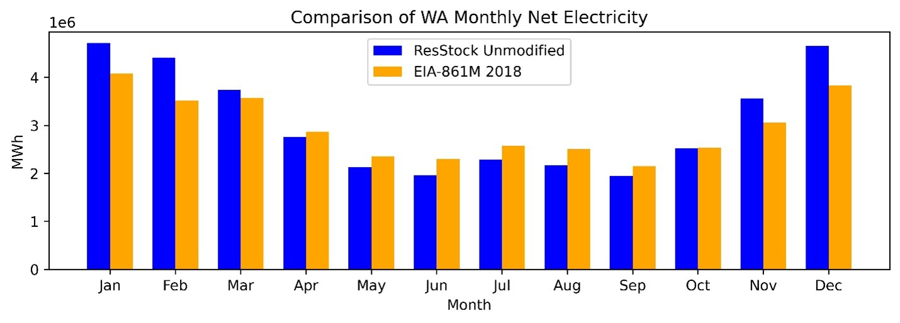
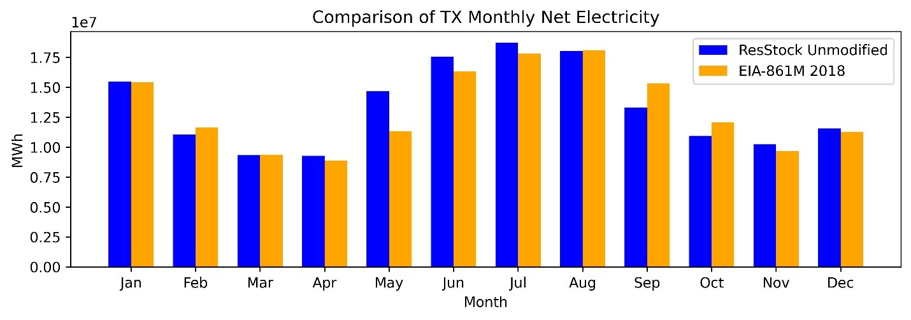
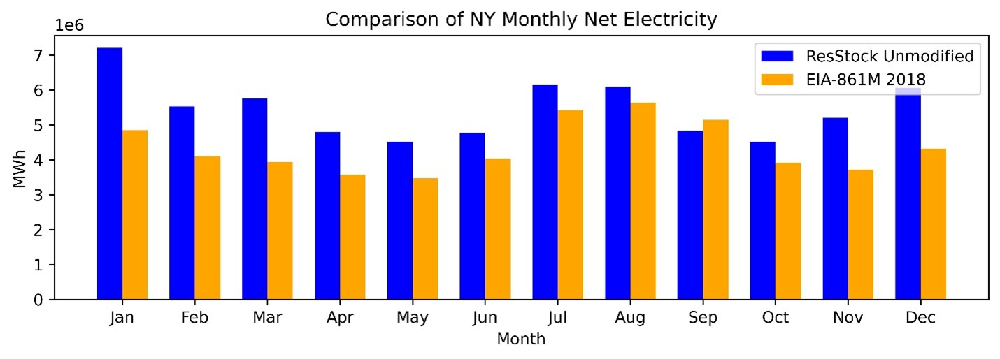
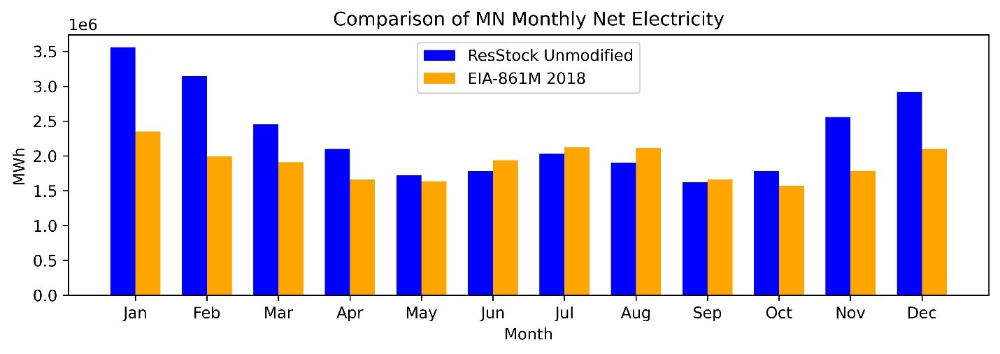

The Sales to Ultimate Consumers dataset within the 2018 EIA-861M form was used as a comparison against monthly net electricity for the ResStock 2024 Release 2 AMY 2018 data.

Approximately 2,300 utilities submit data for EIA-861, and an additional 1,100 small utilities report aggregate sales and customer counts at state and balancing authority levels using form EIA-861S (the short form).

Below are some results showing a comparison between net electricity consumption (on-site generation not included) in ResStock 2024 Release 2 and the EIA-861M Residential sales for select states. The states include Colorado, Florida, Illinois, California, Washington, Texas, New York, and Minnesota.

There are some differences between the two data sources. This is expected because ResStock is a simulation with many data sources, and this is a comparison to only one data source.

Some of this difference may be attributed to ResStock data alignment with the calendar months because it is a simulation, whereas the EIA data may not exactly align. There may be differences in how utilities report data, whether on a calendar monthly basis or a billing period within a month for example. Therefore, reported and actual consumption within a calendar month may not be the same. However, the magnitude of the monthly differences in some cases is large enough that not all of the difference could be due to reporting.

The ResStock team is aware of the differences between the data sources, and has plans to further investigate. For more information on the ResStock data sources, and how ResStock used these sources for calibration and validation efforts, please see the [End Use Load Profiles report](https://docs.nrel.gov/docs/fy22osti/80889.pdf).
