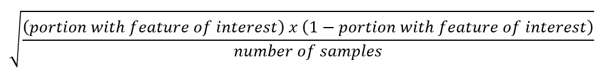
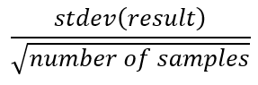
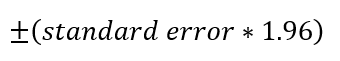

## Introduction
ResStock, like most other datasets, has uncertainty. As stated in [this paper](https://www.nrel.gov/docs/fy22osti/80889.pdf) in section 5.1.3, the two significant areas of uncertainty are 1) stock-level model input parameters, and 2) an insufficient number of ResStock samples. This explanation will focus on understanding whether an analysis is using a sufficient number of ResStock samples for its purposes, in order to get the most it can out of the ResStock dataset.

**The ResStock team recommends estimating the standard error using the standard deviation divided by the square root of the number of samples (i.e. profiles or models) and using the results to inform the appropriate minimum sample size for a particular analysis.** As a conservative reference, using at least 1,000 samples will maintain 15% or lower sampling discrepancy for many common quantities of interest. Continue reading for multiple examples of calculating uncertainty, and situations where less than 1,000 samples can make sense.

## Overview
Increasing the number of samples used in an analysis decreases the sample-size related uncertainty of the results, similar to using survey results. This is because ResStock samples are constructed to represent real homes rather than than "average" or "typical" ones. For example, the national average housing unit has approximately a 0.7 stall garage, whereas each ResStock housing unit has either no garage, or a 1, 2, or 3 stall garage. Using many samples will provide distributional information about the presence and size of garages. The number of samples needed to decrease uncertainty to an acceptable level depends on several factors, including hte type of results used (also referred to as the quantities of interest), the variability in those results, and the analysis' tolerance for uncertainty. Users should consider these questions before starting an analysis of their own.

At some point, adding one more samples no longer has a significant impact on the analysis of the results, which means the quantities of interest has converged. Analyses using 1,000 samples or more should lead to convergence for most quantities of interest, including timeseries results such as peak timing and magnitude. However, many analysis can be successfully conducted with fewer than 1,000 samples, include most that use full year results rather than timeseries.Certain analyses, especially those focused on the timing of less-common loads, could require more. If a larger sample size is created with ResStock samples that are less relevant to the analysis, the value that results from the convergence may not be the best representation of the housing stock for the analysis. In these situations, there is a necessary tradeoff between accuracy and precision.

This explanation provides examples of sample size considerations on the uncertainty in four different types of ResStock results: housing characteristics and annual energy consumption using standard error calculations, and peak timing and peak magnitude using graphical methods.

**ResStock is not a perfect representation of the real world.** Uncertainties in stock-level model input parameters and modeling simplifications lead to an inaccuracy and uncertainty that cannot be reduced by increasing sample size.

## Examples of Evaluating the Number of Samples by Calculating Standard Error
This example will analyze single-family attached (SFA) houses in rural Jefferson County, Colorado. In the ResStock 2024 Release 2 dataset, AMY2018 version, there are five samples that are in Jefferson County, single-family attached, and with a city of "Not in a Census place" (Sample Set A). The metadata for these five samples shows they all have natural gas heating, four have electric cooking, four have electric clothes dryers, one has electric water heating, and three have air conditioning. One of the samples, ID 317840, is an outlier: renter occupied, in the 0-30% AMI income bin, a cooling setpoint of 67F, and an infiltration rate of 50 ACH50. Within a sample of five housing units a mixture of more or less common housing units is expected, but nonetheless this particular housing unit, ID 317840, will likely impact results.

In this example analysis, there are four results of interest:
 - percentage of housing units with propane heating,
 - average site electricity consumption per housing unit,
 - average site electricity consumption for cooling per dwelling unit, and
 - average site propane energy consumption per housing unit.

To calculate the standard error[^1] for each of these results of interest, first determine if the result is categorical or continuous. The only categorical value is whether the house has propane heating. The results of interest are all continuous.

For the categorical variable, whether the house has propane heating, the standard error is calculated as[^2]:

The other results are continuous so the standard error is calculated as:

Optionally, the 95% confidence interval can also be calculated as:

With just five samples, the standard error on total electricity consumption is 11% of the mean. This is just one example, and the 11% is likely lower than it would have been if one or more of the samples happened to use electricity for heating, but higher than it would have been if all of the samples had the same type of cooling. The standard error on the electricity for cooling is 48% of the mean. The standard error for the propane heating prevalence or propane usage could not be calculated because none of the samples use propane.

For some analyses, this subset of five samples might be the right sample to use. For other analyses, larger samples may be required. There are multiple ways to achieve this, and the right one depends on the specifics of the housing stock and the goals of the analysis. Several of these approaches are explored below.

### Approach 1: Expand the geography of the analysis
To expand the sample set, but still keep the samples in a rural location, look for samples with a city of "In another census place", which still avoids the large cities in Jefferson County while bringing the sample size up to 40 (Sample Set B).

Rerunning the calculations seen above, the standard error is now 9% of the mean for site electricity consumption and 11% for cooling electricity consumption. In this Sample Set B of 40 samples, there is one sample that uses propane, ID 157991, however it uses propane only for cooking. The standard error on the site propane consumption is now 100% of the mean. There is nominally a standard error of 0 on the portion of houses using propane for heating, as that characteristic is not present in the sample.

### Approach 2: Expanding the analysis to additional building types and more areas
To add an additional building type to the analysis that is similar to single-family attached, add the samples of the building type multi-family 2-4 (MF 2-4). This is a judgement call as to what building types are similar. Then, to expand the geography, also include the neighboring counties of Boulder, Teller, Gilpin, Park, and Clear Creek to the original Jefferson county.

This brings the sample size up to 81 (Sample Set C). The standard error is now 7% of the mean for site electricity consumption and 10% for cooling electricity consumption, but still 100% for propane consumption because there is still only one dwelling unit with any propane consumption and no samples with propane heating.

### Approach 3: Expanding the analysis to all housing units in the county
In this approach, all dwelling units only from Jefferson County will be used for a sample of 965 (Sample Set D), essentially equivalent to the conservative reference point of 1,000 samples.

The site electricity consumption now has a standard error of 2% of the mean for total electricity consumption and 3% for cooling electricity consumption. However, the mean of the site electricity consumption has now risen outside of the 95% confidence interval for any of the previous three sets of samples. While this is now good precision in the form of a small standard error and correspondingly higher confidence of what the mean of the sample is, the accuracy may have decreased as the sample is representing a different set of housing units than the analysis is looking at.  

There are also now 20 housing unit samples with site usage of propane, leading to a standard error for site propane consumption of 29% of the mean.

There are 13 housing unit samples with propane heating, which represents 1.3% of the total. The standard error on this categorical result is 0.4% or 3.6 housing unit models. After weighting, an analyst might use the standard error to report that Jefferson County has 3,280 ± 904 standard error housing units that heat with propane.

### Approach 4: Restricting the analysis to a more focused sample
An alternative approach is to use a more focused sample. The energy usage statistics above are relying on ResStock both for, for example, whether a dwelling unit has air conditioning and also for how much electricity a dwelling unit with air conditioning uses for cooling. All the dwelling units without air conditioning show in ResStock as using no electricity for cooling (though they may have electricity consumption for other appliances that provide cooling, such as mechanical ventilation or ceiling fans, which are output separately).

Some analyses may benefit from separating these two questions and calculating separately how many housing units have air conditioning and what the average electricity used for cooling is in housing units that have air conditioning. Or, the analysis may have access to different, more specific data for one question and only wish to use ResStock for the other. This approach partially removes effects of uncertainty in the specified stock-level input parameters.

Returning to the 81 samples from *Approach 2* (Sample Set C) and choosing only those with a cooling type of central AC or ducted heat pump results in a sample size of only 48 (Sample Set E). However, rerunning the calculations results in a standard error of 9% of the mean for site electricity and 6% of the mean for cooling electricity. By using a smaller but more focused sample, the standard error as a percent of the mean was reduced from 10% to 6% of the mean for cooling electricity.

Similarly, the standard error as percent of the mean is 14% for average site propane energy consumption when using only the 14 samples in Jefferson County with a heating fuel of propane (Sample Set E) versus 29% using all 965 samples in Jefferson County (Sample Set D).  Using all 422 samples in Colorado with a heating fuel of propane (Sample Set G) reduces the standard error to 3% of the mean.

At what point the sample no longer sufficiently represents the study area of the analysis is a decision for the analyst to make.

### Accuracy versus Precision
The approach to address uncertainty depends on the particulars of the housing stock being studied and the needs of the analysis. Many analyses will encounter a tradeoff between accuracy and precision. Some analyses may want a more specific estimate with lower precision as represented by a larger relative standard error and therefore wider 95% confidence interval. Others may want a less specific estimate that uses a broader sample but has higher precision as represented by a smaller relative standard error and 95% confidence interval.

Table of results from example: Site electricity consumption

| --- | Sample Set A | Sample Set B |Sample Set C |Sample Set D |Sample Set E |Sample Set F |Sample Set G |
| --- | --- | --- | --- | --- | --- | --- | --- |
| **Counties** | Jefferson | Jefferson | Jefferson, Boulder, Teller, Gilpin, Park, Clear Creek | Jefferson | Jefferson, Boulder, Teller, Gilpin, Park, Clear Creek | Jefferson | All of Colorado |
| **Cities** | Not in a Census place | Not in a Census place, In another Census place | Not in a Census place, In another Census place | All | Not in a Census place, In another Census place | All | All |
| **Housing Type** | SFA | SFA |  SFA, MF 2-4 | All | SFA, MF 2-4 | All | All |
| **Heating Fuel** | All (though all were natural gas) | All | All | All | All | Propane | Propane |
| **Cooling Type** | All | All | All | All | Central AC, Ducted Heat Pump | All | All |
| **Number of samples** | 5 | 40 | 81 | 965 | 48 | 14 | 422 |
| **Mean [kWh]** | 6,653 | 7,663 | 7,161 | 9,796 | 7,169 | 6,268 | 7,422 |
| **Standard Error** | 729 | 672 | 507 | 239 | 630 | 1,047 | 206 |
| **Standard Error Percentage of Mean** | 11% | 9% | 7% | 2% | 9% | 17% | 3% |
| **95% Confidence Interval** | ±1,428 | ±1,318 | ±994 | ±469 | ±1,235 | ±2,053 | ±403 |

Table of results from example: Cooling electricity consumption

| --- | Sample Set A | Sample Set B |Sample Set C |Sample Set D |Sample Set E |Sample Set F |Sample Set G |
| --- | --- | --- | --- | --- | --- | --- | --- |
| **Counties** | Jefferson | Jefferson | Jefferson, Boulder, Teller, Gilpin, Park, Clear Creek | Jefferson | Jefferson, Boulder, Teller, Gilpin, Park, Clear Creek | Jefferson | All of Colorado |
| **Cities** | Not in a Census place | Not in a Census place, In another Census place | Not in a Census place, In another Census place | All | Not in a Census place, In another Census place | All | All |
| **Housing Type** | SFA | SFA |  SFA, MF 2-4 | All | SFA, MF 2-4 | All | All |
| **Heating Fuel** | All (though all were natural gas) | All | All | All | All | Propane | Propane |
| **Cooling Type** | All | All | All | All | Central AC, Ducted Heat Pump | All | All |
| **Number of samples** | 5 | 40 | 81 | 965 | 48 | 14 | 422 |
| **Mean [kWh]** | 678 | 855 | 721 | 1,172 | 1,151 | 715 | 1,186 |
| **Standard Error** | 327 | 91 | 71 | 35 | 67 | 258 | 59 |
| **Standard Error Percentage of Mean** | 48% | 11% | 10% | 3% | 6% | 36% | 5% |
| **95% Confidence Interval [kWh]** | ±641 | ±178 | ±140 | ±68 | ±130 | ±505 | ±115 |

Table of results from example: Propane site energy consumption

| --- | Sample Set A | Sample Set B |Sample Set C |Sample Set D |Sample Set E |Sample Set F |Sample Set G |
| --- | --- | --- | --- | --- | --- | --- | --- |
| **Counties** | Jefferson | Jefferson | Jefferson, Boulder, Teller, Gilpin, Park, Clear Creek | Jefferson | Jefferson, Boulder, Teller, Gilpin, Park, Clear Creek | Jefferson | All of Colorado |
| **Cities** | Not in a Census place | Not in a Census place, In another Census place | Not in a Census place, In another Census place | All | Not in a Census place, In another Census place | All | All |
| **Housing Type** | SFA | SFA |  SFA, MF 2-4 | All | SFA, MF 2-4 | All | All |
| **Heating Fuel** | All (though all were natural gas) | All | All | All | All | Propane | Propane |
| **Cooling Type** | All | All | All | All | Central AC, Ducted Heat Pump | All | All |
| **Number of samples** | 5 | 40 | 81 | 965 | 48 | 14 | 422 |
| **Mean [kWh]** | 0 | 26 | 13 | 269 | NA | 18,490 | 23,955 |
| **Standard Error [kWh]** | NA | 26 | 13 | 77 | NA | 2,548 | 731 |
| **Standard Error Percentage of Mean** | NA | 100% | 100% | 29% | NA | 14% | 3% |
| **95% Confidence Interval [kWh]** | NA | ±51 | ±25 | ±151 | NA | ±4,315 | ±1,433 |

## Number of Samples when Analyzing Timeseries Results
Timeseries analysis will generally require higher numbers of samples to reach the same level of certainty. These types of analyses often include assessing the timing or magnitude of peak electricity consumption. Calculating the standard error is an available and useful approach, though that is not done in this explanation. Here is a visual example instead.

In the ResStock team’s experience, uncertainty levels off by 1,000 samples for many common quantities of interest. This is why the ResStock team recommends using 1,000 or more samples for analysis when further specifics are not known.

Above is Figure 386 from the [End Use Load Profiles Methodology report](https://docs.nrel.gov/docs/fy22osti/80889.pdf) which provides one example of the impact of number of samples on timeseries aggregate results in ResStock circa ResStock 2021 Release 1.

In the top row and top left figure, there are two samples used in the timeseries profile. The timeseries is spiky and dominated by the use of the cooking range and clothes dryer. The average 15-minute peak shown is over 1.2 kW per housing unit and occurs  around hour 22.

The figure in the top row middle uses 10 samples. These 10 samples result in a less spiky timeseries, but still show a 15-minute peak over 1.2 kW per housing unit and spikes from individual home appliance.

Moving to 100 samples, in the top right figure, the 15-minute peak load of the day is around 0.9 kW per home. The peak load is about 40% lower than with the 10 samples, and the timeseries average has begun to smooth out.

On the bottom row on the left, there are 1,000 samples. The load profile is much smoother, the 15-minute peak is around 0.9 kW per housing unit and occurs around hour 16-17. While the shape smooths out further at 10,000 and 38,300 samples, the value at each timestep is generally similar across all three lower subfigures. Some analyses will be fine with 100 samples in this example, some will prefer 1,000, and very few would need more than 1,000. Using less than 100 samples could result in a 40% difference in peak magnitude results.

This example is provided for illustrative purposes only. The results for every set of 1, 10, 100, 1,000, and so on samples will not match the above. However, in the team’s experience most quantities of interest converge with less than 1,000 samples and some will in many cases converge with 100 or even 10 samples.

## Concluding Thoughts
All data has uncertainty, but trying to understand and limit the uncertainty or amount of error is part of data analysis. If there are not enough samples within the housing stock of interest, the analyst must make tradeoffs between accuracy, precision, and the effort of supplementing with other information. If the analyst chooses to group their housing stock of interest together with other samples to increase the sample size, relying on knowledge of the local housing stock and topography can inform which samples to add.

[^1]: An alternative approach would be to use bootstrapping.
[^2]: [https://dept.stat.lsa.umich.edu/~kshedden/introds/topics/standard_errors/](https://dept.stat.lsa.umich.edu/~kshedden/introds/topics/standard_errors/)