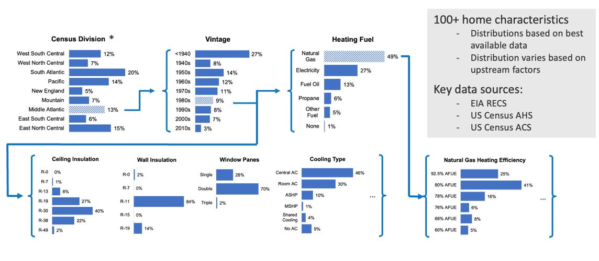

## Quota Based Sampling and the Implications

ResStock uses _conditional probability_ distributions to describe housing. This means that ResStock specifies how common a housing feature is based on other factors like location for example. Each sample in ResStock represents one dwelling unit and will have a value selected for every building characteristic in ResStock. If one characteristic is described based on another, this is known as a _dependency_. For example, the Northeast is predominantly heated by fuel oil while the Southeast relies on electricity for heating and the Midwest a combination of propane and natural gas. These differences can be expressed by defining a heating fuel probability distribution with a dependency on geography. 

The table below is an example of a conditional probability distribution for water heating fuel. There are three parts to this table – _dependencies, options, and sampling probability_. The options are the values a ResStock input (e.g., water heater fuel) can have (e.g., electricity), while the dependencies explain how the ResStock input is distributed (e.g., which water heater fuel is most common varies based on building type, heating fuel, and state). The option columns give all the possible water heating fuel options, and the value of each row will add up to one. Each row gives the ResStock input distribution within a housing segment defined by the dependencies. The *sampling_probability* column provides the likelihood of sampling a home with the dependency characteristics, i.e., the relative size of the housing segment in the U.S. If you multiply the *sampling_probability* by an option in the same row, you get the _joint probability_ those _dependencies_ and that _option_ – this is the likelihood of a home in the U.S. having both those _dependencies_ and that _option_.

| Dependency=Geometry   Building Type RECS | Dependency=  Heating Fuel | Dependency=  State | Option=  Electricity | Option=  Fuel Oil | Option=  Natural Gas | Option=  Other Fuel | Option=  Propane | sampling_probability |
| --- | --- | --- | --- | --- | --- | --- | --- | --- |
| Mobile Home | Electricity | CA | 0.7237 | 0 | 0.1759 | 0 | 0.1005 | 0.0009 |
| Multifamily with   2-4 Units | Electricity | CA | 0.6379 | 0 | 0.3621 | 0 | 0 | 0.0027 |
| Multifamily with   5+ Units | Electricity | CA | 0.5690 | 0 | 0.4217 | 0 | 0.0093 | 0.0114 |
| Single-Family Attached | Electricity | CA | 0.6986 | 0 | 0.2696 | 0 | 0.0318 | 0.0020 |
| Single-Family Detached | **Electricity** | **CA** | **0.3200** | **0** | **0.6428** | **0** | **0.0372** | **0.0107** |

To put all the terms into context, let’s interpret the last row of the table. The *sampling_probability* tells us that 1.07% US housing units are single-family detached homes heated using electricity in California. This also means roughly one in 100 models sampled by ResStock will be in this housing segment. The five option columns (starting with Option=) show the *probability distribution* of water heating in this segment.  The *probability distribution* for Single-Family Detached homes with electric space heating in California has 32.0% of homes using Electricity for water heating, 0% Fuel Oil, 64.28% Natural Gas, 0% Other Fuels, and 3.72% Propane. Each of these option probabilities can be multiplied by the *sampling_probability* of 1.07% to find the overall likelihood of that option being selected in ResStock - the *joint probability*. For example, the *joint probability* of selecting a Single-Family Detached home with electric space heating in California AND electric water heating is 0.0107 * 0.3200 = 0.0034= 0.34%. This can also be stated that 0.34% of housing units in the U.S. are Single-Family Homes in California with electric space heating and electric water heating.

The full set of *conditional probabilities* for ResStock can be found [here](https://github.com/NREL/resstock/tree/develop/project_national/housing_characteristics). Sampling starts with housing characteristics that have no dependencies and then moves to the characteristics that have the first set of characteristics as a dependency until all ResStock inputs are sampled and defined. For example, the figure above shows an example set of housing characteristic distributions that are interconnected by dependencies. To create a building model, the census division is sampled first (and Middle Atlantic is chosen). Then the vintage of the model is sampled based on the distribution of vintage for the chosen census division (1980s is chosen). Next, the heating fuel is sampled according to the distribution for the chosen vintage (natural gas is chosen), and this process repeats until all housing characteristics are determined.

To create a full representative housing stock for the United States, ResStock employs quota-based sampling. In quota-based sampling, you specify how many samples you want (i.e., your ‘quota’). Sampling starts with the most likely/common housing unit in the United States, and then continues filling out increasingly less-likely combinations of characteristics until the quota is reached.  This approach creates building models with equal sample weight, meaning each sampled dwelling unit represents the same number of dwelling units in the real housing stock. This is a product of quota-based sampling where the likelihood of a building characteristic is directly reflected in the number of times that characteristic is sampled instead of being included in the sample weight. The ramification of this sampling approach is that diversity is intimately linked to the quota and to obtain a stock with reasonable diversity, a minimum number of samples is required. See section [Why At Least 1,000 Samples is Recommended]({{ site.baseurl }}).
