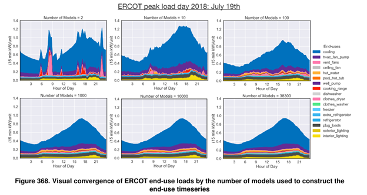
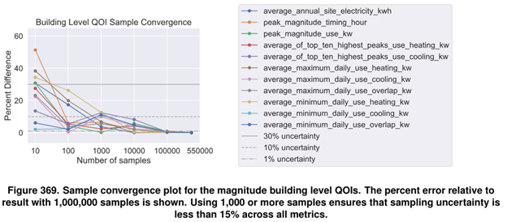

# Why At Least 1,000 Samples is Recommended
ResStock, like every other dataset, has uncertainty. Increasing the number of samples used decreases the uncertainty. This uncertainty levels off around 1,000 samples, which is what the ResStock team recommends using for analysis. Using less than 1,000 samples can result in high levels of uncertainty that are not fit for making decisions or drawing conclusions from.

As stated in [this paper](https://www.nrel.gov/docs/fy22osti/80889.pdf) in section 5.1.3, the two areas that are significant sources of uncertainty are 1) stock-level model input parameters, and 2) an insufficient number of ResStock samples. This explanation will focus on the insufficient number of ResStock samples.

ResStock uses probability distributions for building characteristics. To fully describe the housing characteristics and behavior of the people inside of those buildings, enough samples must be used. Figure 368 is reproduced below for discussion.

In the top row and top left figure, there are two samples used in the timeseries profile. The timeseries is spiky, and dominated by the cooking range and clothes dryer. The figure in the top row middle uses 10 samples. 10 samples results in less spiky timeseries, but it still does not represent the whole building stock well. Moving to 100 samples, the peak load of the day is around 0.9 kW, while in 10 samples it was about 1.3 kW. The peak load at 100 samples is about 40% lower than 10 samples, and you can see the timeseries profile starting to take place now. However, the load shape is still a bit rough. On the bottom row on the left, there are 1,000 samples. The load profile is much smoother, and you can see that the load shape and consumption of each end use is very similar in 1,000 samples, 10,000 samples, and 38,300 samples. This is a visual description of why 1,000 samples should be used.

The ResStock team also did a convergence analysis to show why at least 1,000 samples were optimal. Convergence analysis looks at different quantities of interest and estimates them using different sample sizes. Quantities of analysis in this test were things like average annual site electricity use, peak magnitude, and more. It is around 1,000 samples that all of the tested quantities of analysis have about 15% uncertainty or less. The figure showing the convergence analysis is below.

All data has uncertainty, but trying to limit the uncertainty or amount of error is critical, especially when drawing conclusions or making decisions. If there are not enough samples in an analysis, the ResStock team recommends grouping other nearby geographies together ot increase the sample size and decrease the uncertainty. Talking about uncertainty in data is critical, so see [this training video](https://www.youtube.com/watch?v=h9EYP1FdxRI&list=PLmIn8Hncs7bEYCZiHaoPSovoBrRGR-tRS&index=14) which walks through how to calculate the error. Other sections of this documentation will go through how to check the number of samples that are used in the Data Viewer.
