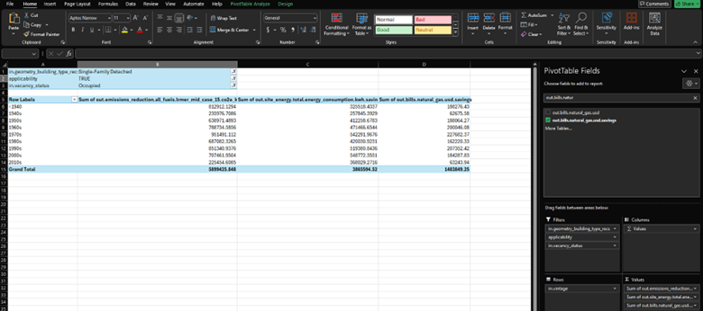

# Analyze Your Housing Stock and Different "What-If" Scenarios Using Excel

Building stock analysis involves collecting and assessing the characteristics of a set of buildings within a defined area. It includes analyzing data about the buildings, such as their physical attributes, energy performance, and occupancy patterns. Analyzing these things can help support policy planning and decision-making related to energy efficiency, energy affordability, and grid impacts.

A typical analysis starts with defining the goal and scope (e.g., retrofits to cut building consumption by X%) and a geographic boundary (e.g., a state, city, or low-income housing only within a county). Then data is collected/generated and amalgamated, often from multiple sources such as tax assessor records, surveys, and energy audits. ResStock can support or even sidestep this typically time- and labor-intensive data collection step by providing housing data aggregated from multiple national datasets. Additionally, ResStock data offers simulated data for estimating the energy performance baseline and energy savings from a broad range of energy efficiency retrofit measures.

The following steps are a starting point for using ResStock data in a residential building stock analysis. If you use ResStock for your residential building stock analysis, spend more time planning out specific questions and goals that you have for your analysis.

We will do a simple analysis to understand some of the characteristics of single-family detached homes in Colorado and identify the energy and utility bill impacts of deploying high-efficiency cold-climate heat pumps with electric back up to all eligible single-family detached homes in the state.

ResStock publishes national level datasets containing the energy baseline and a set of energy efficiency measures on the [Open Energy Data Initiative (OEDI) website](https://data.openei.org/s3_viewer?bucket=oedi-data-lake&prefix=nrel-pds-building-stock). The documentation for each release is on our website, and near each release you will see a Technical Documentation button. We recommend browsing the documentations so that you can choose the dataset that can best answer your questions. The datasets can vary in the type of housing upgrades, weather years, model assumptions, reporting metrics, and more. Below is a screenshot showing an example of where our documentation is located for our 2024.2 dataset.

For this example, we will look at the single-family detached homes in Colorado and try to answer the following questions:
1.	What is the median home size by vintage?
2.	How does the average energy consumption differ by vintage?
3.	How does site energy consumption before and after the upgrade has been applied vary by housing vintage?
4.	Do natural gas energy bills change before and after the upgrade has been applied by housing vintage?

We will use the AMY2018 dataset from the [2024.2 data release](https://oedi-data-lake.s3.amazonaws.com/nrel-pds-building-stock/end-use-load-profiles-for-us-building-stock/2024/resstock_amy2018_release_2/resstock_documentation_2024_release_2.pdf), which contains 16 upgrade packages. According to the [dataset documentation](https://oedi-data-lake.s3.amazonaws.com/nrel-pds-building-stock/end-use-load-profiles-for-us-building-stock/2024/resstock_amy2018_release_2/resstock_documentation_2024_release_2.pdf), Measure Package 2 is a high-efficiency cold-climate air-to-air heat pump paired with electric backup, which we wll examine in the analysis.

This ResStock 2024.2 dataset contains roughly 550,000 dwelling samples that cover the contiguous United States, including Washington D.C., with the lowest geographic resolution available at the intersection of 2010 county and 2010 PUMA regions. In this 2024.2 dataset, each model sample represents about ~252 dwelling units. Refer to Section [Quota-Based Sampling and the Implications]({{ site.baseurl }}) for more details on sampling methods.

To get to the 2024.2 dataset, visit the ResStock website, and go to the Datasets tab. Under the name of each release is a table of information about the release. In the Supplemental Data and Dictionaries column, there is a link for the Data Repository of each dataset. This is how to reach the data on OEDI. Clicking on the Data Repository link for this dataset shows the following:

If you go into the metadata_and_annual_results folder, the data is available at two scales and in two file formats. Metadata refers to the housing characteristics of the dwelling samples, while annual results are annually aggregated metrics from the simulations. The baseline file contains housing metadata as well as the energy baseline, while the upgrade files contain the energy consumption and resulting metrics post-upgrade, upgrade savings, and housing metadata from the baseline.  Below is a screenshot of the file structure showing an example of this for Colorado.

Both the baseline and upgrade files have all data organized by bldg_id or the number of the dwelling unit that was modeled. To compare the baseline and the upgrade file, you can join the two files together by the building_id column, but we will not be demonstrating this in the example today.

The first step of the analysis is to down select to the geography and/or housing segment of interest and examine how many samples are available. This can be done by downloading the appropriate state sample file and further filtering to the geography and/or housing segment of choice. We are focusing on Colorado, single-family detached homes, and Package 2: High efficiency cold-climate air-to-air heat pump with electric backup, so we will download the relevant files. We will need the baseline file too. The files are highlighted below. Click on the file title for it to download.

Open the downloaded CO_baseline_metadata_and_annual_results.csv file, and the first 10 lines look like this.

We are only interested in single-family detached homes, so we have to find a way to filter based on building type. The question is, what column should we use? Let’s review the data_dictionary.tsv, or the file that gives a summary of most of the column titles and what they mean. The data_dictionary.tsv file is found a few folders back, right on the screen we started with.

There are different ways to open a .tsv file, and for this example we will use Excel. Click on the data_dictionary.tsv file, and then open a new instance of Excel. Go to open a new file, and try to open the data_dictionary.tsv file. In your file explorer, make sure All Files is chosen, not All Excel Files: otherwise the data_dictionary.tsv file will not show up. Go through the steps to open up the file, and the first 10 rows will look like this when you are done.

For more information on the data dictionary and how things are labeled in ResStock, see Data and the section Field Naming Convention to get a better idea.

Reading through the data_dictionary.tsv Column B, **field_name**, row 63 has in.geometry_building_type_recs with a field description of "PUMS 2019 building type", and allowable_baseline_enumerations of "Mobile Home", "Multi-Family with 2–4 Units"," Multifamily with 5+ Units", "Single-Family Attached", and "Single-Family Detached". This is the column we need to filter the baseline and upgrade files to only see results for Single-Family Detached homes.

Going back to the CO_baseline_metadata_and_annual_results.csv file, and click <ins>Format as Table</ins> so we can perform our filter.

Then, search for the column name we need to filter: **in.geometry_building_type_recs**. Turns out it is column BK. Click the down arrow in the column, and make sure Single-Family Detached is the only housing option selected. Click <ins>OK</ins> to apply the filter.

Repeat this process to filter to Single-Family Detached homes in the CO_upgrade02_metadata_and_annual_results file too. With the CO_upgrade02_metadata_and_annual_results file, we need to filter to only the samples that have had this upgrade applied, because not every home has this upgrade applied. Some homes may not have the right home configuration or may have an out-of-scope heating fuel: therefore, only some of the homes are actually modeled with this upgrade. To determine the column that describes whether the home received the upgrade or not, go back to the data_dictionary_tsv.

The second row shows a field_name called applicability with a field_description of: The measure was or was not applied to bldg_id. This is what we are looking for. Going back to the CO_upgrade02_metadata_and_annual_results file, search for the **applicability** column, and make sure only TRUE is chosen as an option. That means only the samples that were actually upgraded with our package of interest, high-efficiency cold-climate air-to-air heat pump with electric backup, will be shown. If the value is FALSE, that means the building sample was not upgraded with this package.

Next, check to make sure there are the right number of samples or at least 1,000 samples. For a detailed explanation on why our team recommends this, review the [Why At Least 1,000 Samples is Recommended]({{ site.baseurl }}) webpage.

To do this, highlight the first column of each of the two files, and look at the <ins>Count</ins> value at the bottom right of the screen. For the baseline file, it shows Count: "5901".

Doing the same on the upgrade file, the <ins>Count</ins> value is showing Count: "5701". We expect the count of the upgrade file to be less because not all samples or bldg_id had the upgrade applied.

Luckily for us, each file has over 1,000 samples so we are good to begin the analysis. If the sample count was is than 1,000, our team recommends expanding your geographic search area or changing other filters to increase sample count. See more reasoning for this [here]({{ site.baseurl }}).

We can analyze the data and extract key baseline and upgrade information now that we have confirmed we have enough samples. Let’s revisit the questions for our analysis:
1.	What is the median home size by vintage?
2.	How does the average energy consumption differ by vintage?
3.	How does site energy change before and after the upgrade has been applied by housing vintage?
4.	Do natural gas energy bills change before and after the upgrade has been applied by housing vintage?
To analyze this key information, we first need to know where to look. Back to the data_dictionary.tsv to find out which columns we should analyze!

## Baseline Housing Information

The first two questions deal with the baseline housing, or the housing information without the upgrade applied. For the first question, home size, start by reviewing all of the column names in Column B and their description in Column E. After reading through the list, there are a few options that describe the home size. Lines 64, 65, and 156 all look like they could meet our needs. Let’s work with line 156, **in.sqft**, to look at floor area. Then, let’s determine which value we can use to evaluate energy consumption. Energy consumption for this ResStock dataset is measured in site energy usage. Energy consumption is actually an output on line 292 of the data_dictionary.tsv file, and the field is called **out.site_energy.total.energy_consumption.kwh**. 

Heading back to the CO_baseline_metadata_and_annual_results.csv file, we can start the analysis.

To easily answer these questions, we can use Excel’s built-in <ins>PivotTable</ins>. You can also do this with coding or other means, but for this example we will use Excel. First, go to the <ins>Insert</ins> tab of Excel, and then choose the down arrow under PivotTable and choose From <ins>Table/Range</ins>. When a pop-up appears, choose <ins>New Worksheet</ins>, and then click OK.

The blank <ins>PivotTable</ins> will look like this.

The ResStock columns are on the right, and we will start to pull the fields into the four boxes on the bottom to begin the analysis.

We want to look at the questions by Single-Family Detached homes only, so let’s start with that first filter. In the fields table, click and drag **in.geometry_building_type_recs** into the Filters box. Then, where it says (All), we need to only select Single-Family Detached.

Within Single-Family Detached, we want to look at the analysis by vintage so we will apply that to Rows. Drag in.vintage to the Rows box.

To answer our first question, the column or the field we need to add to the PivotTable is **in.sqft** . In the list of fields, choose **in.sqft** and drag it to the <ins>Values</ins> box. Choose the down arrow next to the box, and choose <ins>Value Field Settings</ins>. When the pop-up window appears, choose <ins>Average</ins> instead of Sum so we can understand the average size of home per vintage.

The resulting table looks like the following.

Over time, the average home size has grown over 1,000 sqft.

The next task is to determine the average energy consumption of homes through different vintages. In the fields list, choose **out.site_energy.total.energy_consumption.kwh** and drag it to the <ins>Values</ins>. Click the down arrow and choose <ins>Value Field Settings</ins> like we did in the previous step. Choose <ins>Average</ins> instead of Count and click OK. The table now shows the average size and energy consumption of the homes over time.

In general, average energy consumption is lowest for homes built in the 1990s and 2000s, and highest for homes built before 1940 and in the 1940s.

These are just two examples of questions about housing that can be answered using the baseline housing information. Before performing a full residential building analysis, identifying questions like the two we just analyzed is a good idea. Now, let’s look at a few examples of using the upgrade information.

## Upgrade Information

As a reminder, these are the two questions we are looking to answer using the upgrade information.
1.	How does site energy change before and after the upgrade has been applied by housing vintage?
2.	Do natural gas energy bills change before and after the upgrade has been applied by housing vintage?

For the site energy question, looking through the data dictionary shows two options, one that subtracts power produced by PV or generators, and one that is just total site energy. Let’s look at the total site energy, which would be **out.site_energy.total.energy_consumption.kwh**. Again, this is just the total amount, not the impact from the upgrade. Going back to the results file and searching for “out.site_energy” you eventually find a column titled **out.site_energy_net.energy_consumption.kwh.savings**, which is what we want for this example.

Then, for the natural gas bills on the data dictionary, we have one option **out.bills.natural_gas.usd**, but we want to know the savings, not just the total bills. Look back at the CO_upgrade02_metadata_and_annual_results file, and search for “out.bills.natural_gas”. There are actually two listings, one is **out.bills.natural_gas**, and the other is **out.bills.natural_gas.usd.savings**, which is what we actually want. Therefore, let’s use the **out.bills.natural_gas.usd.savings**. We’ll use Excel and PivotTable to answer the questions about the upgrade information too. As a first step, insert a new <ins>PivotTable</ins> following the same steps as the baseline housing.

The blank <ins>PivotTable</ins> will look like this.

The ResStock columns are on the right, and we will start to pull the fields into the four boxes on the bottom to begin the analysis.

We want to look at the three questions by Single-Family Detached homes only, so let’s start with that first filter. In the fields table, click and drag **in.geometry_building_type_recs** into the <ins>Filters</ins> box. Then, where it says (All), we need to only select Single-Family Detached.

The models that have been upgraded, or homes that were eligible to receive the cold-climate heat pump with the electric backup, can be identified by the **applicability** column. Drag applicability from the list of fields to the <ins>Filters</ins> box, like we did with **in.geometry_building_type_recs**, and from the down arrow next to the it, choose True. The table now looks like this.

When describing the housing segment, it may be useful to exclude vacant units, or separate them into their own subsegment, as they have very low energy usage and may skew the average values. Vacant homes only have energy consumption from baseloads, like refrigerators and freezers, and some heating loads to prevent frozen pipes. For this example, we will exclude vacant homes. Looking back at the data_dictionary.tsv, we see that line 173 has a field called **in.vacancy_status** that describes if there are occupants in the home or not. Go back to the <ins>PivotTable</ins>, and drag **in.vacancy_status** to the Filters box just like we did for the other two filters, and choose Occupied. All three filters together now look like this.

Now that all of our filters have been applied, we can start looking at the site energy and natural gas bills by vintage. Drag **in.vintage** to the Rows box to get started.

Let’s head to the question: How does site energy change before and after the upgrade has been applied by housing vintage? Choose **out.site_energy.total.energy_consumption.kwh.savings** and drag it into the <ins>Values</ins> box. Similar to the previous steps, change the value from <ins>Count</ins> to <ins>Sum</ins>. The PivotTable now looks like this.

The total amount of kWh saved through this upgrade package applied to applicable houses is "3,865,594" kWh.

Finally, to answer our last question about the savings from natural gas bills. Similar to the first two columns, we drag the column name **out.bills.natural_gas.usd.savings** to the values box and change the field value to <ins>Sum</ins>, not <ins>Count</ins>. Your table will now look like this.

The annual natural gas bill savings for all of the single-family homes that were upgraded was modeled to be "$1,483,849".

Now you have seen examples of how to use PivotTable and answer potential questions about how an upgrade would impact a portion of the housing stock. In general, these are just a few questions that can be answered using the baseline housing results and the upgrade results. If you have more questions about how ResStock could be used for your residential building stock analysis, check out the [Contact]({{ site.baseurl }}) page.