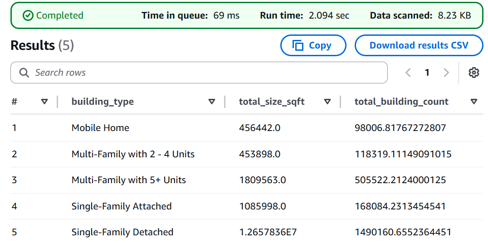
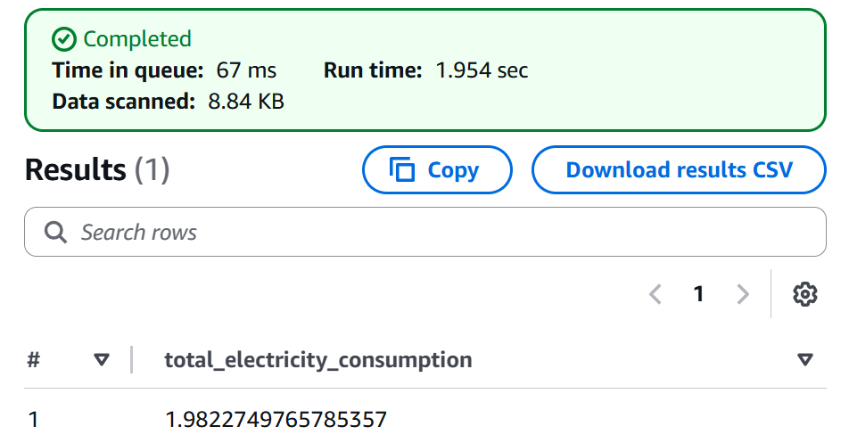

# Amazon Web Services (AWS) Athena Queries

The following queries were run on a table created from this Amazon S3 bucket: [https://data.openei.org/s3_viewer?bucket=oedi-data-lake&prefix=nrel-pds-building-stock%2Fend-use-load-profiles-for-us-building-stock%2F2025%2Fresstock_amy2018_release_1%2Fmetadata_and_annual_results%2F&limit=50](https://data.openei.org/s3_viewer?bucket=oedi-data-lake&prefix=nrel-pds-building-stock%2Fend-use-load-profiles-for-us-building-stock%2F2025%2Fresstock_amy2018_release_1%2Fmetadata_and_annual_results%2F&limit=50)

## Prompt 1: How many dwelling units exist in Colorado , by type and floor area?
<b>Query<b>
```
SELECT
  "in.geometry_building_type_recs" AS building_type,
  SUM("in.sqft..ft2") AS total_size_sqft,
  SUM("weight") AS total_building_count
FROM
  "resstock_amy2018_r1_2025_md_by_state_parquet"
WHERE
  "in.state" = 'CO'and "upgrade" = 0
GROUP BY
  "in.geometry_building_type_recs"
ORDER BY
  "in.geometry_building_type_recs";
```
<b>Results<b>


## Prompt 2: How much electricity would be consumed by electric vehicles charging if each dwelling unit in Alaska got one electric vehicle and one Level 1 charger?
<b>Query<b>
```
SELECT SUM("calc.weighted.electricity.ev_charging.energy_consumption..tbtu") AS total_electricity_consumption
FROM "resstock_amy2018_r1_2025_md_by_state_parquet"
WHERE
"in.state" = 'AK' and "upgrade" = 19;
```
<b>Results<b>


## Prompt 3: What is the average headroom on an electric panel per income level after a cold climate heat pump installation in New York?
TODO: add applicability? is this the right way to average?
<b>Query<b>
```
SELECT
  "in.area_median_income" AS income_level,
  AVG("out.params.panel_breaker_space_headroom_count") AS headroom_count,
  SUM("weight") AS total_building_count
FROM
  "resstock_amy2018_r1_2025_md_by_state_parquet"
WHERE
  "in.state" = 'NY'and "upgrade" = 04
GROUP BY
  "in.area_median_income"
ORDER BY
  "in.area_median_income";
```