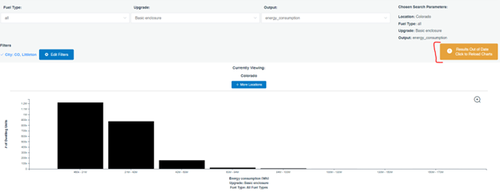

# How To Use The Data Viewer With Enough Samples

The Data Viewer is a tool that can show annual and timeseries data with premade visuals that can be downloaded. This tutorial will show you how to get 1,000 samples in the Data Viewer using the End Use Savings Shapes 2022.1 Release, representing 242,000 dwelling units.

<!-- 
Want more information on the Data Viewer, what it is, and how to access it? See [this section on Data] for more information.
-->

**To illustrate the capabilities of the Data Viewer, the question we want to answer is: How much annual energy could be saved if all dwelling units in Littleton, Colorado, had the basic enclosure package applied?**

For this example, we are doing a city-based filter, but the same procedure applies for any down selection in the Data Viewer. This includes other geographies, building characteristics, or demographics.

On the [ResStock datasets page](https://resstock.nrel.gov/datasets), scroll down to End Use Savings Shapes 2022.1 Release. Notice that the fourth column has Data Viewer Links by state. Click on the first line option, which is "by state."

A separate tab will appear that will ask you to log in with a free account. At first, there will be a map of the United States. From here, you can select a state.

The Data Viewer shows three types of information: 1) bar charts, 2) timeseries, and 3) histograms. For this example, we will be using Colorado as the starting point.

**Step 1: Type "Colorado" into the Type a Location Box**
Now, you can see that bar charts, timeseries, and histograms are all available to analyze.

For this example, our analysis question is: How much annual energy could be saved if all dwelling units in Littleton, Colorado, had the Upgrade 1: Basic Enclosure Package applied?

ResStock recommends a minimum sample size of 1,000 for most applications to minimize the error. For the 2022.1 dataset, those 1,000 samples represent 242,000 dwelling units.

To make sure we have 1,000 samples, we will first look at Histograms, which tell us how many dwelling units are in the location.

**Step 2: Click Explore Histograms**

This is what the homepage of Explore Histograms looks like.

Notice at the top there are dropdown menus to choose fuel type, upgrade name, and output metric for the histogram. In this case, we are looking at all fuel types and only dwelling units eligible for the basic enclosure upgrade, the output metric is annual energy consumption, and it is for the whole state of Colorado. The bottom of the screen displays the histogram with annual energy consumption [Wh] on the x-axis and # (number) of dwelling units on the y-axis.

Now, we have results for the impact of the upgrade package for the whole state of Colorado, but how do we select only Littleton? To do this, we will add a "Filter" for City.

**Step 3: Click + Add Filters**

Click on the "+Add Filters" button in the middle-left of the screen (bracketed in red here).

**Step 4: Filter to Littleton**
Click "City", and then choose CO, Littleton from the alphabetical list. Once you choose CO, Littleton it should appear as a check in the upper right corner. Then, click Save Filters.

After clicking "Save Filters," an orange button pops up on the right that says the results are out of date. This means that the displayed histogram does not yet incorporate our filter.

**Step 5: Apply Filter to Results**

Click "Results Out of Date, Click to Reload Results" to make sure our filters are appropriately applied.

Now, the number of dwelling units has gone from 1.2 million dwelling units in the first column to about 2,000 dwelling units.

This is how you can tell the filter has been applied.

**Step 6: Verify Dwelling Unit Count**
Add together the number of dwelling units from each column to check if there are 242,000 dwelling units. Hover your mouse over each column to see how many dwelling units there are in each column.

Hovering over each of the columns gives you the values below and the total: _1,937 + 4,358 + 4,358 + 3,874 + 3,148 + 1,211 + 1,695 + 484 = 21,065_

For this example of CO, Littleton there are 21,065 dwelling units present, **less than 10% of the recommended 240,000 dwelling units**. Now, we need to find ways ways to expand our sample either by geography or other characteristics to get to our target sample size.

**Step 7: Identify Nearby Geographies That Can Be Included in the Analysis**

For this analysis, we decide to expand our sample by including the nearby areas. First, click _Edit Filters > City_ and scroll to _Colorado_ to see what other geographies can be chosen from the list. Then, pulling up Google Maps and searching for Littleton, CO shows that some nearby cities that are also in the City list include Englewood, Lakewood, Centennial, Highlands Ranch, Arvada, Denver, and Westminster. 

In this case, we use personal experience combined with the mapping to select cities from the list above. Most of these cities are suburban areas of the Denver metro area, with lots of single-family detached housing. We decide not to include Denver because it is more densely populated, and is likely to have more multifamily housing than Littleton. Use your best personal judgement when expanding your geography or other filters to include more samples.

**Step 8: Add In Another City**
We start by adding in  Englewood, to see if that gives us sufficient dwelling units. The City filter should already be pulled up from Step 7. Choose CO, Englewood from this list. Now, there should be two cities with check marks at the top. Choose Save Filters and remember to click the Results Out of Date, Click to Reload Results button to make sure our filter is applied.

**Step 9: Recalculate Dwelling Units**
Like Step 6, add together the number of dwelling units to check if there are 242,000 dwelling units. With these two cities chosen, there are 36,803 dwelling units. We have almost doubled the number of dwelling units, but we are still not close to the recommended 242,000 dwelling units.

**Step 10: Continue Sample Expansion**
Continue adding cities from those identified in Step 7 until there are 242,000 dwelling units. After adding in Littleton, Englewood, Lakewood, Centennial, Highlands Ranch, Arvada, and Westminster there are finally 271,671 dwelling units. We are finally above the recommended 242,000 dwelling units!

Now that the area has been defined, we look at annual energy savings if these dwelling units had the basic enclosure applied.

**Step 11: Pull Up Bar Charts**
Hit the back button on your browser and click _Explore Bar Charts_.

On the Bar Charts page, the top section is similar to Histograms with fuel type, upgrade, output, location, and filter button. The middle section is the legend which color codes end uses. Hovering your mouse over one end use will highlight it on the two graphs below.

The bottom left graph shows the Annual Energy Consumption in Watt hours [Wh] for the Baseline scenario and the upgrade, which in this case is the Basic Enclosure. The bottom right graph calls out the Annual Energy Savings [Wh] by end type.

The example right now is for all of Colorado, but our main question is how much annual energy could be saved if all dwelling units in Littleton, Colorado, had the Basic Enclosure package applied?

**Step 12: Downselect to Our Sample Area**
Add in the location filters that we determined with the Histogram charts in Step 10. Use the _Add Filters_ button and the orange update results buttons just as we have in similar steps. Your screen should look like the figure below.

**Step 13: Determine Energy Savings for Littleton**
Determine what the annual energy savings are for just Littleton by normalizing the results. The results shown in the histograms currently represent the savings from 271,671 units in different geographic locations, but Littleton only has 21,065 dwelling units eligible for the basic enclosure upgrade (from Step 6). The baseline energy consumption (i.e., the energy before an upgrade) is approximately 7.75 TWh, and the basic enclosure energy consumption is approximately 6.5 TWh for all 271,671 dwelling units in the expanded sample. You can scale the sample to the target geography using the following calculation:

_Energy Use Target Area = Energy Use Sample x (Dwelling Units in Target Area/Dwelling Units in Sample)_

For our example, to calculate the baseline energy use for Littleton using our larger sample:

_Baseline Littleton = 7.75 TWh sample x (21,065 units Littleton/271,671 units sample) = 0.60 TWh = 600 GWh_

We take the 7.75 TWh used in the baseline, multiply it by the number of applicable units in Littleton (21,065) and divide it by the number of dwelling units in our sample (271,671). The resulting calculations show that before an upgrade, the applicable dwellings in Littleton use 0.60 TWh or 600 GWh.

_Upgrade Littleton = 6.5 TWh sample x (21,065 units Littleton/271,671 units sample) = 0.50 TWh = 500 GWh_

Similarly, we can find the energy use in Littleton by swapping the 7.75 TWh of the sample baseline for the 6.5 TWh of the sample basic enclosure case. After upgrading all 21,065 units, ResStock estimates that these homes in Littleton will use 500 GWh. This means that Littleton can save approximately 100 GWh of energy annually if all applicable Littleton dwelling units upgraded to the Basic Enclosure.

In the example above, we expanded the sample size by including surrounding areas. Similar expansion could be done based on other characteristics, such as pulling in homes of similar ages or with other relevant characteristics. The steps of the analysis remain similar---figure out an expansion strategy, check sample size, and then scale results based upon the ratio of dwelling units in the target area to the dwelling units in your sample.